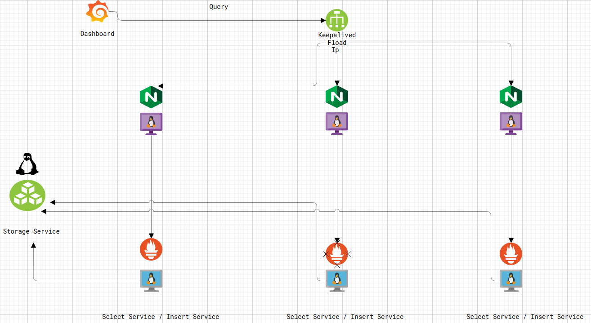

# eranyacloud_victoria

[](https://github.com/eranyacloud/eranyacloud_victoria)
[](https://github.com/eranyacloud/eranyacloud_victoria/blob/main/LICENSE)

## Introduction

Welcome to the eranyacloud_victoria project! This repository is designed to provide you with a powerful and flexible solution for achieving high availability in your Prometheus-based monitoring infrastructure using VictoriaMetrics.

- **GitHub Repository:** [eranyacloud/eranyacloud_victoria](https://github.com/eranyacloud/eranyacloud_victoria)

## About eranyacloud_victoria

The eranyacloud_victoria project aims to simplify the process of setting up and configuring a high-availability monitoring stack with VictoriaMetrics and Prometheus. It addresses the need for redundancy and fault tolerance in monitoring systems, ensuring that you can rely on your infrastructure for critical monitoring and alerting needs.

## Features

- **High Availability:** Eliminate single points of failure by replicating VictoriaMetrics instances and distributing traffic using load balancers.
- **Easy Setup:** Streamlined installation process with clear instructions.
- **Monitoring and Alerting:** Monitor the health and performance of your monitoring infrastructure and receive alerts in case of issues.
- **Backup and Restore:** Implement data backup and restore strategies to safeguard your monitoring data.

Eranyacloud_Victoria
=========

A brief description of the role goes here.





Requirements
------------

Any pre-requisites that may not be covered by Ansible itself or the role should be mentioned here. For instance, if the role uses the EC2 module, it may be a good idea to mention in this section that the boto package is required.
```bash

sudo apt update

sudo apt install software-properties-common

sudo add-apt-repository --yes --update ppa:ansible/ansible

sudo apt install ansible
```
Role Variables
--------------

A description of the settable variables for this role should go here, including any variables that are in defaults/main.yml, vars/main.yml, and any variables that can/should be set via parameters to the role. Any variables that are read from other roles and/or the global scope (ie. hostvars, group vars, etc.) should be mentioned here as well.

Dependencies
------------

A list of other roles hosted on Galaxy should go here, plus any details in regards to parameters that may need to be set for other roles, or variables that are used from other roles.
* Change the variable depending on your infrastructure

```yml
vim deault/main.yml

---
# defaults file for victoria

#Download Victoria Metrics

victoria_version: "v1.63.0"

#VMSTORAGE
retentionPeriod: 3d

#prometheus and nodeexporter
prometheus_version: "2.47.0"
nodeexporter_version: "1.6.1"
prometheus_retention: 15d
remote_write: 185.213.165.167

## Keepalived
interfaces: eth0
virtual_ip_address: 185.213.165.167

storageNodes:
  - 185.213.165.228


select_inserts:
  - 185.213.165.166
  - 185.213.165.34
  - 185.213.165.180

```
* Note: Modify the inventory file to match your infrastructure:

```bash

[all]
185.213.165.228 ansible_user=root
185.213.165.166 ansible_user=root
185.213.165.34 ansible_user=root
185.213.165.180 ansible_user=root

[storages]
185.213.165.228

[select_inserts]
185.213.165.166 ansible_user=root
185.213.165.34  ansible_user=root
185.213.165.180 ansible_user=root

[ha]
185.213.165.121 ansible_user=root
185.213.165.204 ansible_user=root
185.213.165.36 ansible_user=root

```
Example Playbook
----------------

Including an example of how to use your role (for instance, with variables passed in as parameters) is always nice for users too:
How can I use this playbook

### Deploy the preinstall downloading victoria petrics and Copy binary file to the /bin:

```bash
ansible-playbook -i inventory -e 'machine=all' --tag preinstall install.yaml

```
### Configuring the VmStorage on the Storage Server

```bash
ansible-playbook -i inventory -e 'machine=storages' --tag storage install.yaml
```
### Configuring the VmSelect on the Select Server

```bash
ansible-playbook -i inventory -e 'machine=select_inserts' --tag select install.yaml
```


### Configuring the VmInsert on the insert Server

```bash
ansible-playbook -i inventory -e 'machine=select_inserts' --tag insert install.yaml
```

### Deploying loadBalancer(nginx and Keepalived) on The loadbalancer Server

```bash
Note: deploying nginx and keepalived
ansible-playbook -i inventory -e 'machine=ha' --tag all install.yaml 

OR

Note: deploying nginx

ansible-playbook -i inventory -e 'machine=ha' --tag nginx install.yaml

Note: deploying keepalived
ansible-playbook -i inventory -e 'machine=ha' --tag keepalived install.yaml

```

### Deploying Promethus on the Linux server

```bash
ansible-playbook -i inventory -e 'machine=select_inserts' --tag prometheus install.yaml

```

### Deploying NodeExporter on the Linux server

```bash
ansible-playbook -i inventory -e 'machine=select_inserts' --tag node_exporter install.yaml

```

License
-------
MIT

Author Information
------------------

An optional section for the role authors to include contact information, or a website (HTML is not allowed).

## Getting Started

To get started with eranyacloud_victoria, please follow the instructions provided in the [project's documentation](https://github.com/eranyacloud/eranyacloud_victoria/blob/main/README.md). You'll find detailed guidance on installation, configuration, and best practices.

## Contributing

We welcome contributions from the community! If you have ideas for improvements, bug fixes, or new features, please open an issue or submit a pull request on the GitHub repository.

Before contributing, please review our [Contribution Guidelines](https://github.com/eranyacloud/eranyacloud_victoria/blob/main/CONTRIBUTING.md).

## License

This project is open-source and available under the [MIT License](https://github.com/eranyacloud/eranyacloud_victoria/blob/main/LICENSE). You are free to use, modify, and distribute this software in compliance with the license terms.

## Support and Feedback

If you have any questions, encounter issues, or want to provide feedback, please create an issue on the GitHub repository or contact us at [contact@eranyacloud.com](mailto:contact@eranyacloud.com).

We hope eranyacloud_victoria proves to be a valuable addition to your monitoring infrastructure. Thank you for choosing our project!

**Happy Monitoring!**
